# @poem/parser

中文古典诗词格律分析引擎。给定一首诗/词，查韵书标平仄，匹配格律模板，输出逐字合规报告。

## 包结构

```
@poem/parser          ← 全部导出（类型 + 纯函数 + 工具）
@poem/parser/kernel   ← 纯核态（零 fs/path 依赖，浏览器/Worker 可用）
@poem/parser/types    ← 仅核心类型
@poem/parser/loader   ← Node 环境韵书加载器（createRhymeDict）
@poem/parser/catalog  ← 词牌目录查询（818 首索引，供 Web/RN 选择器）
```

## 快速开始

**Node 环境（从 JSON 加载韵书）：**

```ts
import { analyzeSync, loadMeterTemplates } from "@poem/parser/kernel";
import { createRhymeDict } from "@poem/parser/loader";

const tpl = loadMeterTemplates().find((m) => m.id === "wujue-zeqi")!;
const dict = await createRhymeDict("pingshui", "./data");

const r = analyzeSync("白日依山尽，\n黄河入海流。\n欲穷千里目，\n更上一层楼。", tpl, dict);
```

**浏览器 / 非 Node 环境（自定义韵书）：**

```ts
import { analyzeSync, loadMeterTemplates, RhymeDictType } from "@poem/parser/kernel";
import type { RhymeDict, RhymeEntry } from "@poem/parser/kernel";

class MyDict implements RhymeDict {
  type = RhymeDictType.Pingshui;
  lookup(char: string): RhymeEntry[] { /* fetch / IndexedDB / 内存 Map */ }
  getRhymeGroup(char: string): string[] { /* ... */ }
  isSameRhyme(a: string, b: string): boolean { /* ... */ }
}

const r = analyzeSync(text, template, new MyDict());
```

## 流程

```mermaid
flowchart TD
    INPUT["用户输入诗词文本"]

    INPUT --> SPLIT{"有 pattern 字段？<br/>(MeterTemplate vs CiTemplate)"}

    %% ──── 诗体路径 ────
    SPLIT -->|"诗体 (MeterTemplate)"| LEX["lex(input)<br/>标点标准化 → 按换行拆句 → 提取汉字<br/>返回 LexLine[] + metadata"]
    LEX --> PRE["countHanzi(input)<br/>字数预检：总数 vs charPerLine × lineCount<br/>不匹配直接抛错"]
    PRE --> ANNO["annotate(lexResult, dict)<br/>逐字查韵书 → 标平仄 + 韵部<br/>输出 CharNode[][] + 多音字列表"]

    %% ──── 词牌路径 ────
    SPLIT -->|"词牌 (CiTemplate)"| CISPLIT["splitSentences(input)<br/>按标点 (，。！？；、换行) 分句<br/>返回 string[]"]
    CISPLIT --> CILEX["buildLexResultFromRawLines(sentences)<br/>包装为 LexResult 格式"]
    CILEX --> CIPRE["词牌字数预检：变体必须指定<br/>总数 vs 变体各句 charCount 之和"]
    CIPRE --> ANNO

    %% ──── 公共路径 ────
    ANNO --> AST["buildAst(annotation, type, dictType)<br/>CharNode[][] → LineNode[] → PoemAST<br/>type 由 preferredType 或模板推导"]

    AST --> MATCH{"template 类型？"}

    %% ──── 诗体匹配 ────
    MATCH -->|"诗体"| METER["matchTemplate(ast, [meterTemplate])<br/>逐行逐字对比 fixed 位<br/>统计 toneDeviations, 计算 confidence 0~1"]

    %% ──── 词牌匹配 ────
    MATCH -->|"词牌"| CIVAR["scoreCiVariant(astLines, variant)<br/>字数匹配度评分<br/>（变体由用户指定，不自动推断）"]
    CIVAR --> CIAST["applyCiVariantToAst(ast, ciTemplate, variantScore)<br/>写回 expectedPattern, isRhymeLine<br/>构建 sections (上阕/下阕)"]

    METER --> APPLY["applyTemplate(ast, template, bestMatch)<br/>诗体：applyMeterTemplateToAst<br/>设置 expectedPattern, rhymeLine 索引<br/>构建 couplets (颔联/颈联标记对仗)"]
    CIAST --> APPLY

    APPLY --> AMBIG["resolveAmbiguities(ambiguities, ast, template, bestMatch)<br/>根据最佳模板过滤多音字歧义<br/>若某读音符合模板约束 → 不再视为歧义"]

    AMBIG --> VALID["validate(ast, ambiguities)<br/>逐行 validateLineAgainstPattern<br/>每字对比 expectedPattern vs actualTone<br/>标记 pass / fail / flexible / rescued<br/>排除多音字计算 nonAmbiguousMismatchCount"]

    VALID --> RESCUE["analyzeRescue(couplet, meterTemplate, dict)<br/>检测 4 种拗救：<br/>本句自救 / 对句相救 / 三四互救 / 孤平救<br/>仅诗体触发"]

    VALID --> OUTPUT["AnalysisResult<br/>ast / bestMatch / matchResults<br/>complianceRate / fullyCompliant<br/>ambiguities / lineValidations / summary"]

    OUTPUT --> REPORTER["Reporter (可选)<br/>toJSON / toAnnotatedText / toCLI"]
```



> **三个分叉点。** 输入阶段：诗体 `lex→countHanzi`，词牌 `splitSentences→ci字数预检` → `annotate` 汇合。匹配阶段：诗体比 pattern 置信度，词牌评分配指定变体。`resolveAmbiguities→validate→result` 共用。拗救仅诗体。

## 管线 7 步速览

| 步骤 | 函数 | 职责 |
|------|------|------|
| 1 | `lexStep` | 分词：诗体 lex / 词牌分句 → 统一输出 LexResult |
| 1.5 | `countHanzi` | 字数预检：诗体 vs charPerLine×lineCount，词牌 vs 变体总字数 |
| 2 | `annotateStep` | 音韵标注：查韵书 → 每字标平仄 + 韵部 |
| 3 | `buildAst` | 构建 AST：CharNode[][] → LineNode[] → PoemAST |
| 4 | `matchStep` | 匹配：诗体比 pattern 置信度，词牌选变体 + 写回 AST |
| 5 | `applyTemplate` | 应用模板：expectedPattern / rhymeLine / couplets / sections |
| 6 | `resolveAmbiguities` | 消歧：根据最佳模板过滤多音字 |
| 7 | `validate` | 校验：逐行逐字对比 → 合规率 |

## 数据来源

### 格律模板（MeterTemplate）

16 种近体诗格律硬编码于 `templates/meters.ts`，涵盖五言/七言 × 律诗/绝句 × 平起/仄起 × 首句入韵/不入韵。

### 词牌格律（CiTemplate）

818 首词牌、2475 个变体预编译于 `data/ci-tunes-bundle-compact.json`（1.1 MB，`data/ci-tunes-bundle-compact.json.gz` 为 132 KB），运行时 O(1) 查找。变体以作者命名：

```
水调歌头-苏轼体1      ← 苏轼《明月几时有》
声声慢-李清照体1      ← 李清照《寻寻觅觅》
满江红-柳永体1        ← 柳永正体，岳飞沿用
```

同一作者有多个版本时加数字后缀（如 `苏轼体1`、`苏轼体2`），按原始数据出场顺序编号。

> 原始数据来源：钦定词谱等公开词谱文献，经 `scripts/clean-data.mjs` 清洗 → `scripts/build-ci-bundle.mjs` 合并编译，再由 `scripts/build-compact-bundle.ts` 生成紧凑 DSL bundle。

### 韵书（RhymeDict）

| 韵书 | 标识 | 数据文件 |
|------|------|----------|
| 平水韵 | `"pingshui"` | `rhyme-char-index.json` + `tone-lookup.json` |
| 词林正韵 | `"cilin"` | 同上（合并在 rhyme-char-index 中） |
| 中华新韵 | `"zhonghua_new"` | 同上 |

逐字标注平仄和韵部，支持多音字检测。经由 `@poem/parser/loader` 的 `createRhymeDict` 从 JSON 构造，或自行实现 `RhymeDict` 接口。

---

# API 参考

## 主入口 `@poem/parser`

### 核心分析函数

| 函数 | 签名 | 说明 |
|------|------|------|
| `analyzeSync` | `(input, template, dict, options?) → AnalysisResult` | 全诗分析。所有依赖注入，纯函数 |
| `analyzeLineSync` | `(input, template, dict, context) → LineValidationResult` | 单行分析。支持注入相邻行做拗救上下文 |
| `analyzeStreamSync` | `(input, template, dict, options?) → StreamAnalyzeResult` | 流式逐字分析。输入不完整时只校验已有部分 |

### 工具函数

| 函数 | 签名 | 说明 |
|------|------|------|
| `lex` | `(input: string) → LexResult` | 词法分析：标点标准化 → 按换行拆句 → 提取汉字 |
| `splitSentences` | `(input: string) → string[]` | 按中文标点分句，词牌/流式场景用 |
| `annotate` | `(lexResult, dict) → AnnotationResult` | 音韵标注：逐字查韵书，标注平仄和韵部 |
| `matchTemplate` | `(ast, templates) → MatchResult[]` | 模板匹配：逐字对比 pattern，返回置信度排序 |
| `analyzeRescue` | `(couplet, template, dict) → RescueDetail[]` | 拗救检测：本句自救/对句相救/三四互救/孤平救 |
| `loadMeterTemplates` | `() → MeterTemplate[]` | 返回 16 种硬编码格律模板（纯函数） |
| `createCharNode` | `(params) → CharNode` | 工厂：创建字符节点 |
| `createLineNode` | `(params) → LineNode` | 工厂：创建行节点 |

### 报告函数

| 函数 | 签名 | 说明 |
|------|------|------|
| `toJSON` | `(result: AnalysisResult) → string` | 格式化为 JSON |
| `toAnnotatedText` | `(result: AnalysisResult) → string` | 逐字标平仄的文本格式 |
| `toCLI` | `(result: AnalysisResult) → string` | 终端友好的命令行输出 |

### 类型

#### 分析结果

| 类型 | 关键字段 |
|------|----------|
| `AnalysisResult` | `ast`, `bestMatch`, `matchResults`, `complianceRate`, `fullyCompliant`, `isCompliant`, `ambiguities`, `diagnostics`, `lineValidations`, `summary` |
| `LineValidationResult` | `line`, `expectedPattern`, `actualTones`, `matchScore`, `diagnostics`, `ambiguities`, `rhymeCheck`, `rescues`, `contextHints` |
| `StreamAnalyzeResult` | `templateId`, `totalSentences`, `sentenceCharCounts`, `segments`, `sentenceSummaries` |
| `StreamSegment` | `segmentIndex`, `text`, `sentenceIndex`, `startCol`, `validation` |
| `MatchResult` | `templateId`, `confidence`, `toneDeviations` |

#### AST 节点

| 类型 | 关键字段 |
|------|----------|
| `PoemAST` | `type` (PoemType), `lines`, `couplets?`, `sections?`, `templateId?`, `rhymeDictType`, `diagnostics`, `rhymeSequence?` |
| `LineNode` | `raw`, `chars`, `charCount`, `globalLineIndex`, `isRhymeLine`, `rhymeChar?`, `expectedPattern?`, `coupletRole?`, `requiresDuizhang?`, `diagnostics` |
| `CharNode` | `char`, `tone`, `toneOptions?`, `rhymeGroup?`, `position` (global/line/col), `expectedConstraint?`, `validationStatus?` |
| `CoupletNode` | `upper`, `lower`, `coupletIndex`, `requiresDuizhang`, `diagnostics` |
| `SectionNode` | `sectionIndex`, `name`, `lines` |

#### 模板类型

| 类型 | 关键字段 |
|------|----------|
| `MeterTemplate` | `id`, `type` (PoemType), `name`, `charPerLine` (5\|7), `lineCount` (4\|8), `pattern`, `rhymeLineIndices` |
| `CiTemplate` | `id`, `name`, `aliases?`, `variants`, `source?` |
| `CiTemplateVariant` | `id`, `name`, `sketch?`, `author?`, `sections` |
| `CiTemplateLine` | `charCount`, `pattern`, `isRhymeLine`, `rhymeType?`, `rhymeSwitch?` |
| `AnyTemplate` | `MeterTemplate \| CiTemplate` |

#### 韵书接口

| 类型 | 关键字段 |
|------|----------|
| `RhymeDict` | interface: `type`, `lookup(char) → RhymeEntry[]`, `getRhymeGroup(char) → string[]`, `isSameRhyme(a, b) → boolean` |
| `RhymeEntry` | `char`, `tone` (Tone), `rhymeGroup`, `pronunciation?` |

#### 管道/工具类型

| 类型 | 关键字段 |
|------|----------|
| `LexResult` | `lines`, `metadata` (totalLines, charsPerLine) |
| `LexLine` | `raw`, `chars`, `punctuation` |
| `AnnotationResult` | `chars` (CharNode[][]), `ambiguities` (ToneAmbiguity[]) |
| `ToneAmbiguity` | `char`, `position`, `options`, `suggestion?` |
| `Diagnostic` | `type` ("violation"\|"rescue"\|"info"\|"ambiguity"), `severity`, `position`, `message`, `rescueInfo?` |
| `RescueDetail` | `type` (RescueType), `naoPosition`, `jiuPosition`, `description` |
| `RhymeInfo` | `lineIndex`, `char`, `rhymeGroup`, `tone`, `isConsistent` |
| `ResolvedLineTemplate` | `templateId`, `expectedPattern`, `charCount`, `isRhymeLine`, `sectionInfo?`, `variantId?` |
| `LineValidationSummary` | `lineIndex`, `checkableCount`, `matchedCount`, `mismatchCount`, `nonAmbiguousMismatchCount`, `isCompliant`, `charChecks` |

#### 常量

| 常量 | 成员 | 值 |
|------|------|-----|
| `Tone` | `Ping \| Ze \| Unknown` | `"平" \| "仄" \| "未知"` |
| `PoemType` | `Lüshi \| Jueju \| Ci` | `"lüshi" \| "jueju" \| "ci"` |
| `RhymeTone` | `Ping \| Ze` | `"ping" \| "ze"` |
| `CoupletRole` | `Upper \| Lower` | `"upper" \| "lower"` |
| `SectionName` | `ShangQue \| XiaQue` | `"上阕" \| "下阕"` |
| `RhymeDictType` | `Pingshui \| Cilin \| Zhonghua` | `"pingshui" \| "cilin" \| "zhonghua_new"` |
| `CharValidationStatus` | `Pass \| Fail \| Flexible \| Rescued \| Unknown` | `"pass" \| "fail" \| "flexible" \| "rescued" \| "unknown"` |
| `RescueType` | 联合类型 | `"benju-zijiou" \| "duiju-xiangjiou" \| "sansi-hujiou" \| "guping-jiou"` |
| `ToneConstraint` | 联合类型 | `{ type:"fixed"; tone } \| { type:"flexible" } \| { type:"rhyme"; group? }` |

---

## 内核 `@poem/parser/kernel`

零 fs/path 依赖，浏览器/Worker/VS Code 可用。除主入口的全部核心函数外，额外暴露管线步骤：

| 函数 | 说明 |
|------|------|
| `runPipeline` | 运行完整 7 步管线，返回 `PipelineOutput` |
| `lexStep` | 步骤 1：统一分词（诗体 lex / 词牌分句） |
| `annotateStep` | 步骤 2：音韵标注 |
| `buildAst` | 步骤 3：构建 PoemAST |
| `matchStep` | 步骤 4：模板/变体匹配 |
| `applyTemplate` | 步骤 5：将匹配到的模板写回 AST |
| `resolveAmbiguities` | 步骤 6：根据最佳匹配过滤多音字歧义 |
| `validate` | 步骤 7：逐行校验，计算合规率 |
| `getTemplateType` | 从模板 ID 推断诗歌体裁 |
| `resolveLineTemplate` | 解析单行对应的模板约束 |
| `getSentenceCharCounts` | 从模板提取每句期望字数 |

## 类型 `@poem/parser/types`

纯类型入口，仅导出 `core/types.ts` 中的 21 个类型/接口/常量，零运行时代码。

## 加载器 `@poem/parser/loader`

Node 环境专用，从磁盘 JSON 构造韵书。

| 函数 | 签名 | 说明 |
|------|------|------|
| `createRhymeDict` | `(type: RhymeDictType, dataDir: string) → Promise<RhymeDict>` | 异步加载韵书索引和音调查询表，返回 `JsonRhymeDict` 实例 |
| `clearRhymeCache` | `() → void` | 清空内部缓存（测试隔离用） |

## 模板目录 `@poem/parser/catalog`

统一索引：4 种诗体格律 + 818 首词牌。供 Web/RN 构建体裁选择器。

| 函数 | 说明 |
|------|------|
| `listAllTemplates()` | 全部模板：格律 4 种（七律/五律/七绝/五绝）+ 词牌 818 首，每项含变体列表 |
| `findMeterTemplate(id)` | 按 ID 查格律（如 `"qijue-pingqi"`） |
| `findCiTune(name)` | 按名查词牌（如 `"水调歌头"`） |
| `listCiTuneNames()` | 所有词牌名 |
| `filterCiByCharCount(min, max)` | 按字数筛选词牌变体 |
| `filterCiByAuthor(author)` | 按作者筛选词牌变体 |

```ts
import { listAllTemplates, findMeterTemplate, findCiTune } from "@poem/parser/catalog";

// 体裁选择器：格律在最前，词牌随后
const all = listAllTemplates();
all.map(t => ({ name: t.name, genre: t.genre, count: t.variantCount }));
// [{ name: "七律", genre: "meter", count: 2 }, ... { name: "水调歌头", genre: "ci", count: 11 }, ...]

// 格律详情
findMeterTemplate("qijue-pingqi");  // { id, author: "平起", sketch: "首句不入韵 · 七言四句", charCount: 28 }

// 词牌详情
findCiTune("水调歌头");  // { variantCount: 11, variants: [{ id: "水调歌头-苏轼体1", ... }] }
```

完整格律（CiTemplate、MeterTemplate）从 bundle / `loadMeterTemplates()` 按需获取，不走 catalog。

## 自定义韵书

实现 `RhymeDict` 接口即可接入任意韵书系统：

```ts
import { RhymeDictType } from "@poem/parser/kernel";
import type { RhymeDict, RhymeEntry } from "@poem/parser/kernel";

class MyDict implements RhymeDict {
  type = RhymeDictType.Pingshui;
  lookup(char: string): RhymeEntry[] { /* ... */ }
  getRhymeGroup(char: string): string[] { /* ... */ }
  isSameRhyme(a: string, b: string): boolean { /* ... */ }
}
```

## 自定义词牌（自度曲）

手写 `CiTemplate` 对象，传给 `analyzeSync`，与内置词牌同等对待：

```ts
import type { CiTemplate } from "@poem/parser/kernel";

const myTune: CiTemplate = {
  id: "自度曲·某某",
  name: "某某",
  variants: [{
    id: "v1",
    name: "正体",
    sections: [
      { name: "上阕", lines: [/* CiTemplateLine[] */] },
      { name: "下阕", lines: [/* CiTemplateLine[] */] },
    ],
  }],
};
```
